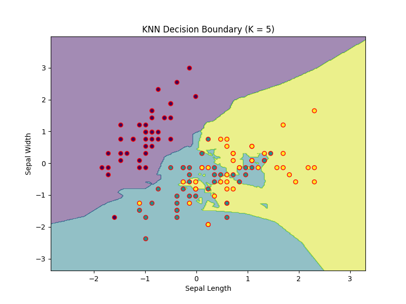

# Week 4: Classification Algorithms

##  📘 Description
### In this repository i have implemented my machine learning internship  week 4 task.In the first task i have train logistic regression on breast cancer data and got accuracy of 97 % further more i have plot ROC curve and calcualte AUC value.
In the Second Task i have trained K nearest neighbor algorithm on iris Data set.Plot Sepal length and Sepal width using scatter plot to visualize iris satosa and iris versicolor.Train KNN classifier with differenrt K values of 1,3,5,7,11,15.Plot the accuracy score for each K value.Train model using eucladian distance and manhatan distance.Lastly draw a decision boundry for k=5.In the third task I have implemented Decision Tree classifier using wine quality Dataset.Train Decision tree classifier using different max_depth value and got accuracy for each depth.Visualize tree and save as an image. Identify optimal depth(5).Calcualte feature importance for depth 5 and visualize it.Save the best model.
In Task four i perform mulitclass classification on digit dataset.I have implement Logistic regression,K nearest neighbor ,and Decision tree algorithm. Compare their performance using accuracy score confusion metrix and classification report.Draw bar plot to visualize their accuracies

## 📑 Table of Contents
- [Task 4.1: Logistic Regression for Binary Classification (4 hours)](#task-41-logistic-regression-for-binary-classification)
- [Task 4.2: K-Nearest Neighbors (KNN) Classification (3 hours)](#Task-42-K-Nearest-Neighbors-(KNN)-Classification)
- [Task 4.3: Decision Tree Classifier (4 hours)](#Task-43-Decision-Tree-Classifier-(4-hours))

## Task 4.1: Logistic Regression for Binary Classification
1. Load Breast cancer dataset.
2. Perform basic EDA.
3. Plot diagnosis Destribution.
4. Define Dependent and independent Varaible
5. Scale Feature using Standard scalar.
6. Train Logistic Regression.
7. Evaluate the model using Accuracy score,Recal score,precision score and f1 score.
8. Save the model using pickle.
   ## Metric and Score
  <table>
  <thead>
    <tr>
      <th>Metric</th>
      <th>Score</th>
    </tr>
  </thead>
  <tbody>
    <tr>
      <td>Accuracy Score</td>
      <td>97.4%</td>
    </tr>
    <tr>
      <td>Precision Score</td>
      <td>97.6%</td>
    </tr>
    <tr>
      <td>Recall Score</td>
      <td>95.3%</td>
    </tr>
    <tr>
      <td>F1 Score</td>
      <td>96.5%</td>
    </tr>
  </tbody>
</table>
## Classification report:
<table>
  <thead>
    <tr>
      <th>Class</th>
      <th>Precision</th>
      <th>Recall</th>
      <th>F1-Score</th>
      <th>Support</th>
    </tr>
  </thead>
  <tbody>
    <tr>
      <td>0</td>
      <td>0.97</td>
      <td>0.99</td>
      <td>0.98</td>
      <td>71</td>
    </tr>
    <tr>
      <td>1</td>
      <td>0.98</td>
      <td>0.95</td>
      <td>0.96</td>
      <td>43</td>
    </tr>
    <tr>
      <td><strong>Accuracy</strong></td>
      <td colspan="3">0.97</td>
      <td>114</td>
    </tr>
    <tr>
      <td><strong>Macro Avg</strong></td>
      <td>0.97</td>
      <td>0.97</td>
      <td>0.97</td>
      <td>114</td>
    </tr>
    <tr>
      <td><strong>Weighted Avg</strong></td>
      <td>0.97</td>
      <td>0.97</td>
      <td>0.97</td>
      <td>114</td>
    </tr>
  </tbody>
</table>

# Task 4.2: K-Nearest Neighbors (KNN) Classification (3 hours)
In this task I have implemented  K-Nearest Neighbors (KNN) Classifier to classify iris flower based on sepal and petal length and width.Train the model using different K values and distance metrics.
1. Train model on k= 1,3,5,7,11,= and 15 using eucaldain and manhatan distance metric
2. Calcualte acccuracy for each k and distance metric
3. Visualize Accuracy
4. Indentify optimal value of k which is 1 that give us accuracy  of 1.0 without beng overfit the model
5. Draw decison bounndry of k=5
6. Save the model
## Decision boundry for k=5

## Comparison Table
When distance metric is Euclidean
<table>
  <thead>
    <tr>
      <th>k Value</th>
      <th>Accuracy</th>
    </tr>
  </thead>
  <tbody>
    <tr><td>1</td><td>1.00</td></tr>
    <tr><td>3</td><td>1.00</td></tr>
    <tr><td>5</td><td>1.00</td></tr>
    <tr><td>7</td><td>1.00</td></tr>
    <tr><td>11</td><td>1.00</td></tr>
    <tr><td>15</td><td>1.00</td></tr>
  </tbody>
</table>

When Distance metric  Manhatan
<table>
  <thead>
    <tr>
      <th>k Value</th>
      <th>Accuracy</th>
    </tr>
  </thead>
  <tbody>
    <tr><td>1</td><td>0.966</td></tr>
    <tr><td>3</td><td>1.00</td></tr>
    <tr><td>5</td><td>1.00</td></tr>
    <tr><td>7</td><td>1.00</td></tr>
    <tr><td>11</td><td>1.00</td></tr>
    <tr><td>15</td><td>1.00</td></tr>
  </tbody>
</table>
# Task 4.3: Decision Tree Classifier (4 hours)
